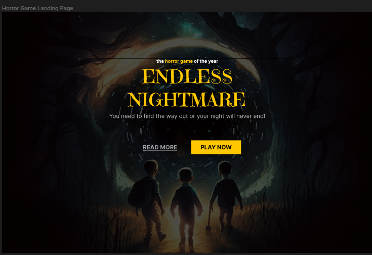

# CSS - Cascading StyleSheet

Folha de estilo em cascata

## Declarations 

* selector -> seletor
* property -> propriedade
* value -> valor


Esse [Site](https://pt-br.imgbb.com) é um serviço gratuito de hospedagem de imagens.

Nesse [Site](https://fonts.google.com/) tem vários tipos de fontes.

## Desafios

#### Desafio feito na aula <p>

**Antes** <br>


**Depois** <br>


#### Desafio feito sozinha :)

**Antes** <br>


**Depois** <br>


OBS.: Por algum motivo o meu navegador não conseguiu reconhecer o estilo aplicado no arquivo CSS da tag de paragráfo ```<p>``` nesse desafio :(